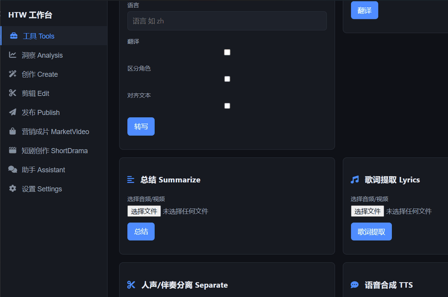
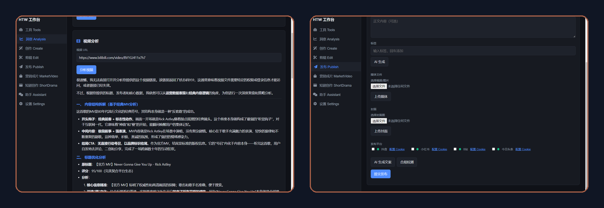

<div align="center">

# HTW Media Client 🎬

### 从「今天发什么」到「发完没」，一个工作台做完

选题没灵感、脚本写不动、剪片耗半天、发四个平台要开四个后台 ——
HTW Media Client 把 **选题 → 创作 → 剪辑 → 发布** 收进同一个桌面工作台，
重活（转写、渲染、发布）全部在服务端跑，本地只管点。

<p align="center">
  
</p>

[](https://github.com/HTWMedia/HTWClient/releases/latest)
[](https://github.com/HTWMedia/HTWClient/releases/latest)
[](https://htwmedia.dpdns.org)
[](https://www.electronjs.org/)
[](LICENSE)
[](https://github.com/HTWMedia/HTWClient/stargazers)

简体中文 ｜ [问题反馈](https://github.com/HTWMedia/HTWClient/issues) ｜ [版本发布](https://github.com/HTWMedia/HTWClient/releases) ｜ [在线体验](https://htwmedia.dpdns.org)

</div>

---

## 三个让你留下来的理由

1. **全链路，不是单点工具**：洞察、选题、创作、剪辑、发布在一个工作台里闭环 —— 多数工具只解决其中一环，剩下的还是要你自己拼。
2. **重活在云端，不吃本机**：转写、渲染、发布都由服务端算力完成，老笔记本也能跑批量任务。
3. **Agent 原生**：同一套能力同时以 Agent Skills 开放，Claude Code / Cursor 之类的 AI 助手可以直接编排「查热点 → 写脚本 → 出片 → 发布」整条流水线。

---

## 界面预览 🖥️



> 🎬 以上 30 秒演示的录制分镜见 [docs/demo-script.md](docs/demo-script.md)。

左侧是 9 个能力面板，各面板统一走 `/api/v2/*` 契约（`{ ok, data, errCode, errMsg, taskId }`）：



---

## 快速开始 🚀

### 方式一：直接下载（推荐）

到 [Releases](https://github.com/HTWMedia/HTWClient/releases/latest) 下载 Windows 安装包：

| 文件 | 说明 |
| --- | --- |
| `HTW.Media.Setup.0.3.0.exe` | 安装版，带开始菜单快捷方式 |
| `HTW.Media.0.3.0.exe` | 便携版，双击即用，不写注册表 |

启动后在左侧 **设置** 填入 `AuthKey` 即可使用全部能力。
AuthKey 在 [HTW 媒体平台](https://htwmedia.dpdns.org) Web 端「设置」里创建，
**新用户注册即送 1 个月免费额度**（有效期 30 天，可续期）。

### 方式二：从源码启动

```bash
cd apps/desktop
npm install      # 首次需下载 Electron
npm start        # 启动工作台
```

### 方式三：浏览器直接用（macOS / Linux / 任意设备）

桌面端目前提供 Windows 安装包；Mac 与 Linux 用户直接访问
<https://htwmedia.dpdns.org> 即可获得**完全一致的能力** —— 客户端与 Web 端调用同一套
`/api/v2/*` 契约，共用同一账号与配额，无需安装、无需编译。

---

## 能力全景 🎯

| 面板 | 能做什么 | 适合什么时候用 |
| --- | --- | --- |
| 💡 **选题 Topics** | **今日选题**（结合热榜与你的垂类画像，每天给出带数据证据的选题卡）、**对标雷达**（加对标账号建基线，同行爆款超基线自动提醒）、**热榜趋势**（小时级热度曲线，标注上升期 / 平台期 / 已过气） | 每天早上决定「今天发什么」 |
| 📈 **洞察 Analysis** | 文案拆解（标题 / 标签 / 钩子 / 爆款元素）、视频解析（B站 / 小红书 / 抖音 链接 → 运营分析报告）、热榜速览 | 拆解同行爆款，找可复用的套路 |
| ✨ **创作 Create** | 主题驱动生成短视频脚本 / 图文 / 文章；可选「调研 · 关键点提取 · 素材搜索 · 自动发布」；实时进度与「确认 / 重新生成 / 精修」 | 从一句想法到可拍的脚本 |
| 🎬 **营销成片 MarketVideo** | 上传商品参考图或视频，自动生成卖点与口播文案，产出带营销浮层的带货短视频 | 电商带货、商品种草 |
| 🎭 **短剧创作 ShortDrama** | 描述剧情创意，自动完成规划 → 剧本 → 分镜 → 成片，支持多轮细化 | 剧情号连续更新 |
| ✂️ **剪辑 Edit** | **粗剪**（设定成片时长区间与配音文案，自动生成精简版）、**超分**（提升到 1080P 等目标分辨率）、**草稿导出**（导入剪映 / CapCut 草稿 ZIP 继续编辑）、**解密**（解析剪映草稿 JSON） | 已有素材，需要加工成片 |
| 📤 **发布 Publish** | 一次分发到 **抖音 · 小红书 · B站 · 今日头条**；发布前合规检测；AI 生成文案与封面；任务队列 / 历史 / 重试 | 一次搞定四个平台 |
| 🧰 **工具 Tools** | 字幕、转写、翻译、内容总结、歌词提取、人声 / 伴奏分离、TTS 配音 | 处理音频素材 |
| 💬 **助手 Assistant** | 对话式入口，用自然语言驱动上面的能力 | 不想找按钮的时候 |

其他值得一提的：

- **客户端只做调度**：所有重活（转写、剪辑、渲染、发布）都在服务端完成，客户端升级不影响你的素材；
- **大文件直传**：内置分片上传，域名慢时自动直连源站 IP；
- **全流程可脚本化**：`agent/` 下的 Skills 与 CLI 暴露了同样的能力，可接进你自己的自动化。

选题模块的接口契约与数据模型见 [docs/prd-topic-selection.md](docs/prd-topic-selection.md)。

---

## 三条典型工作流 🔁

**① 日更博主（选题 → 成片 → 发布，一天一轮）**
早上打开「选题」看今日选题卡 → 选一条点「进入创作」→ 创作面板生成脚本、实时看进度、不满意就精修 → 成片直接送「发布」→ 勾四个平台，合规检测完提交。

**② 带货短视频（商品图 → 成片）**
「营销成片」上传商品参考图 → 自动生成卖点与口播 → 预览成片并下载 → 进「发布」配好平台直接发。

**③ 批量混剪（已有草稿，只要出片）**
「剪辑 → 草稿导出」导入剪映草稿 ZIP → 服务端处理后下载可编辑工程；
如果你只需要**批量把草稿渲染成片**，用姊妹项目 [HDraft](https://github.com/HTWMedia/JyDraft) 更直接 —— 命令行，多草稿并发。

---

## 给 AI 助手用 🤖

`agent/` 下的 Skills 与 CLI 覆盖了和桌面端相同的能力，可被任意支持 Skill 的 AI Agent 调用：

```bash
cd agent/cli
export HTW_API_KEY="你的-key"
node htw-skills.mjs list                        # 列出可用能力
node htw-skills.mjs call insight --hot --dry-run
```

能力清单：`insight` · `create` · `publish` · `edit` · `marketing` · `shortdrama` · `tools`。
完整 CLI 参数见 [docs/getting-started.md](docs/getting-started.md)。

> 换句话说：你可以让 AI 助手自己完成「分析这个视频 → 写个脚本 → 生成视频 → 发到小红书」，人只负责最后确认。

---

## 项目结构 📂

```
.
├─ apps/desktop/        # Electron 桌面客户端（本仓库主程序）
│  ├─ main.js  preload.js  index.html
│  ├─ js/               # 工作台 UI 与 9 个能力面板
│  └─ assets/icon.ico
├─ agent/               # Agent Skills + Node CLI（可被 npx / AI Agent 调用）
│  ├─ skills/           # htw-media-{insight,create,publish,tools,edit,marketing,shortdrama}
│  └─ cli/
└─ docs/                # 上手指南、选题 PRD、路线图、演示分镜
```

> 客户端只负责调用 `/api/v2/*` 契约，所有重活都在 HTW 媒体平台服务端完成。

---

## 🔒 数据与信任 🛡️

创作素材和平台账号是创作者的命根子，我们把策略摊开说。
以下每一行都与代码行为一致，欢迎直接审阅 `apps/desktop/` 源码验证；如有变更会同步更新本表。

| 你担心的 | 实际情况 |
| --- | --- |
| 素材 / 成片存在哪？ | 仅在服务端处理期间临时使用，**任务完成即销毁，不做保留** |
| 平台 Cookie 会传给服务器吗？ | **不会**。Cookie 只存在你本地客户端；发布时由客户端直接携带登录态请求各平台，不经过 HTW 服务器 |
| 有人看我的内容吗？ | **没有**。转写 / 剪辑 / 发布均由自动化流水线处理，全程无人工介入 |
| 会不会跑一半跑路？ | 平台持续运营中；**新用户注册即送 1 个月免费额度**（AuthKey 有效期 30 天，可续期）。演进规划公开在 [路线图](docs/roadmap.md) |
| AuthKey 是干什么用的？ | 防流量攻击的准入闸口，不做内容授权、不采集你的素材 |

---

## 常见问题 🤔

<details>
<summary><b>没有 AuthKey 怎么办？</b></summary>

打开 [HTW 媒体平台](https://htwmedia.dpdns.org)，在 Web 端「设置」中创建 AuthKey，
复制后粘贴到桌面端左侧「设置」即可。所有接口通过请求头 `AuthKey: <key>` 校验。
</details>

<details>
<summary><b>提示 402 / 额度用完？</b></summary>

`402` 表示**免费额度已用完**（不是 Key 失效，Key 失效是 `401`）。
到平台充值后即可继续；额度只在真正消耗算力的环节（渲染、粗剪、超分等）扣减，
失败的任务不会白白扣。
</details>

<details>
<summary><b>上传大视频很慢 / 卡住？</b></summary>

客户端已内置分片上传与「直连源站」策略：域名访问缓慢时自动改用源站 IP 直传
（默认 HTTP，可用环境变量 `HTW_API_DIRECT` 覆盖为 `https://`）。
8MB 分片在 Cloudflare 边缘可能触发 100-continue 挂起，因此统一走直连通道以保稳定。
</details>

<details>
<summary><b>发布到抖音 / 小红书失败？</b></summary>

多平台发布依赖各平台的登录态（Cookie）。在「发布」面板点击对应平台的
「配置 Cookie」填入后再提交；缺少 Cookie 时会明确提示「以下平台尚未配置 Cookie，无法发布」。
Cookie 只存在本地，不会上传到服务器。
</details>

<details>
<summary><b>Mac 能用吗？</b></summary>

能。Mac 与 Linux 用户直接用 Web 端 <https://htwmedia.dpdns.org>，
能力与桌面端一致（同一账号、同一配额）。桌面端目前仅提供 Windows 安装包。
</details>

---

## 配置要求 📦

| 项目 | 说明 |
| --- | --- |
| 系统 | Windows 10+（桌面端）／ macOS、Linux、任意带浏览器的设备（Web 端） |
| 运行 | 下载版无需 Node.js；源码启动需 Node.js 18+ |
| 账号 | 需 HTW 媒体平台 `AuthKey`，新用户赠 1 个月免费额度 |

## 参与贡献 🤝

Issue 与 PR 都欢迎。提 Bug 时附上客户端版本、系统与复现步骤会快很多。
功能建议请直接开 Issue 描述你的使用场景 —— 场景比功能清单更好评估优先级。

## 许可证 📝

本项目基于 [MIT](LICENSE) 许可证开源。

## Star History

<a href="https://www.star-history.com/?repos=HTWMedia%2FHTWClient&type=date&legend=top-left">
  <picture>
    <source media="(prefers-color-scheme: dark)" srcset="https://api.star-history.com/chart?repos=HTWMedia/HTWClient&type=date&theme=dark&legend=top-left">
    <source media="(prefers-color-scheme: light)" srcset="https://api.star-history.com/chart?repos=HTWMedia/HTWClient&type=date&legend=top-left">
    
  </picture>
</a>
