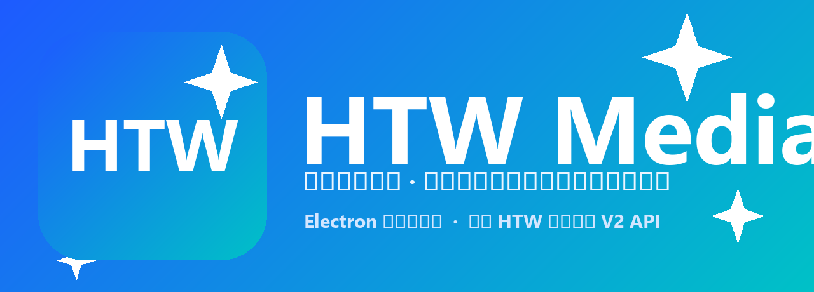
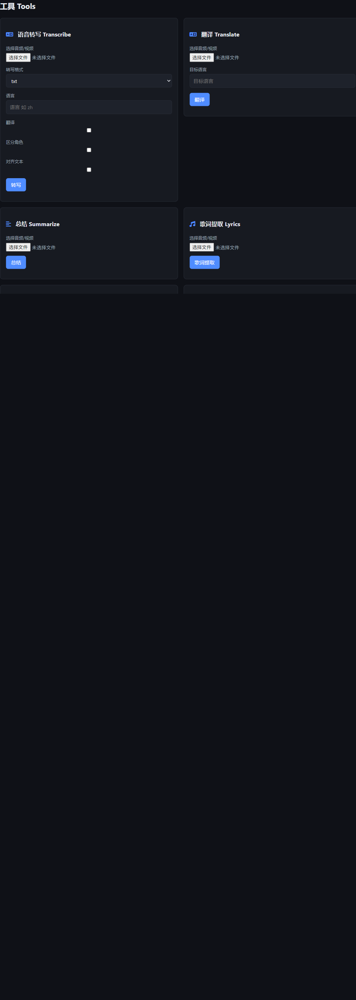
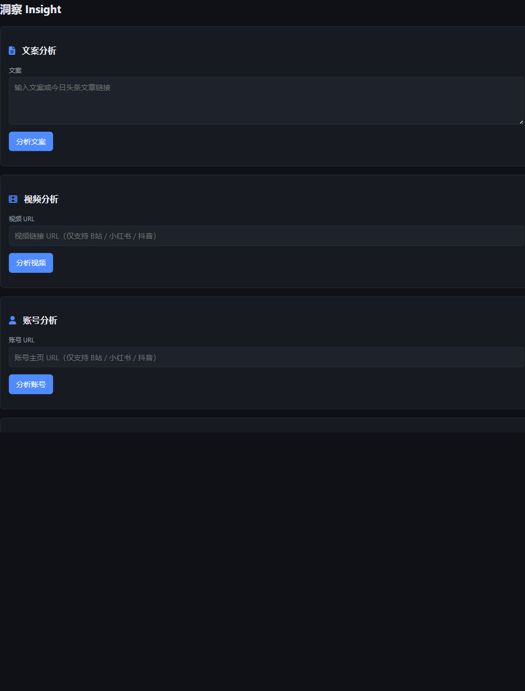
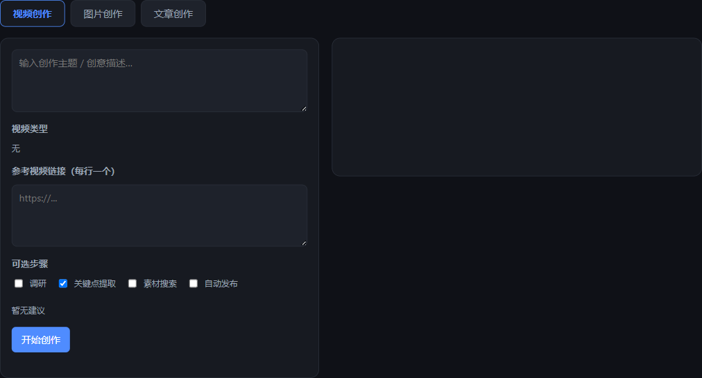
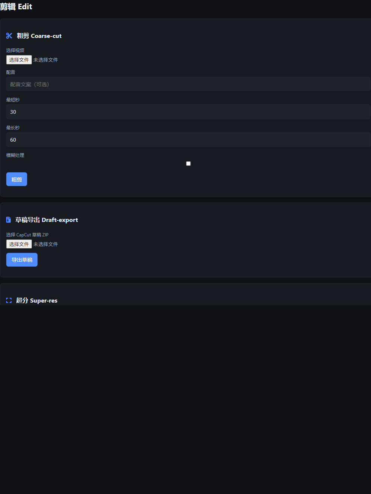
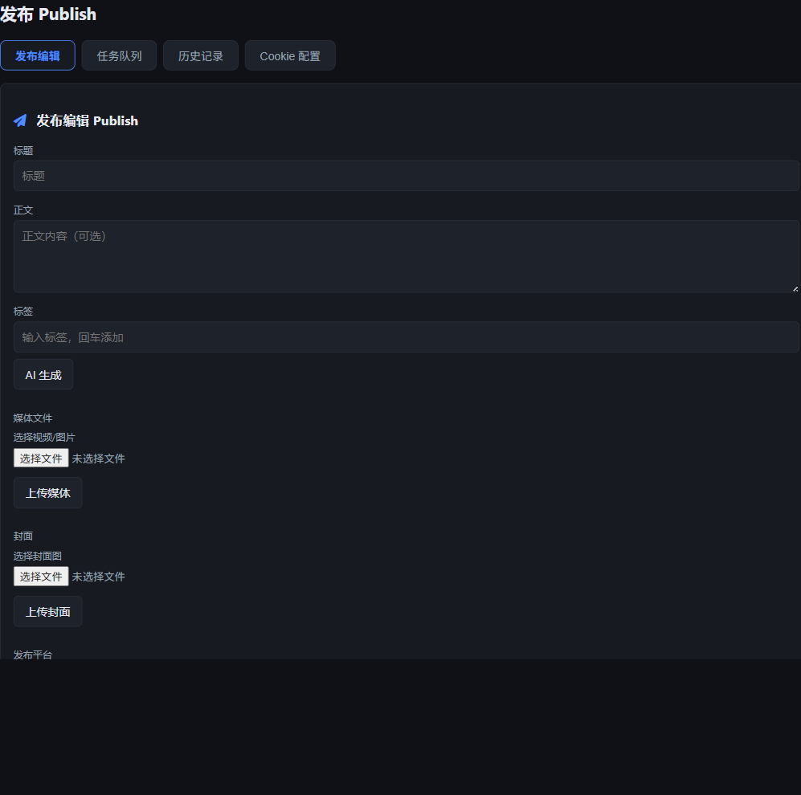

<div align="center">

# HTW Media Client 🎬

### 一站式短视频 · 图文创作与多平台发布桌面客户端

基于 Electron 的**开源桌面客户端**，对接 [HTW 媒体平台](https://htwmedia.dpdns.org) V2 API，把「转写字幕、媒资洞察、内容创作、智能剪辑、多平台发布」全部收进一个工作台。

<p align="center">
  <a href="docs/images/banner.png"></a>
</p>

[](https://github.com/HTWMedia/HTWClient/releases)
[](https://github.com/HTWMedia/HTWClient/releases)
[](https://www.electronjs.org/)
[](LICENSE)
[](https://github.com/HTWMedia/HTWClient/stargazers)

简体中文 ｜ [问题反馈](https://github.com/HTWMedia/HTWClient/issues) ｜ [版本发布](https://github.com/HTWMedia/HTWClient/releases)

</div>

---

## 界面预览 🖥️

工作台内置五大能力面板，统一 V2 契约 `{ ok, data, errCode, errMsg, taskId }`：

<table align="center">
  <tr>
    <td align="center" width="50%"></td>
    <td align="center" width="50%"></td>
  </tr>
  <tr>
    <td align="center">🔤 音频转写 / 字幕</td>
    <td align="center">📊 媒资洞察（文案 / 视频）</td>
  </tr>
  <tr>
    <td align="center" width="50%"></td>
    <td align="center" width="50%"></td>
  </tr>
  <tr>
    <td align="center">✍️ 内容创作</td>
    <td align="center">✂️ 智能剪辑 / 草稿导出</td>
  </tr>
  <tr>
    <td align="center" width="50%" colspan="2"></td>
  </tr>
  <tr>
    <td align="center" colspan="2">🚀 多平台一键发布（抖音 / 小红书 / B站 / 今日头条）</td>
  </tr>
</table>

---

## 功能特性 🎯

- [x] **音频转写 / 字幕**：视频、音频一键转写，由剪映能力驱动，输出可下载字幕文本
- [x] **媒资洞察**：
  - [x] 文案分析 —— 标题、标签、钩子、爆款元素拆解
  - [x] 视频分析 —— 解析 B站 / 小红书 / 抖音 链接，给出运营分析报告
  - [x] 热榜速览 —— 紧跟平台热点
- [x] **内容创作**：AI 辅助生成短视频脚本与图文内容
- [x] **智能剪辑**：粗剪、剪映草稿解密 / 导出、视频超分
- [x] **多平台发布**：
  - [x] 支持 **抖音 · 小红书 · B站 · 今日头条** 一次分发
  - [x] 发布前 **合规检测**，规避违规风险
  - [x] **AI 生成文案** 与封面，省去重复劳动
- [x] **大文件直传**：客户端内置分片上传，自动绕过慢速域名，直连源站 IP 提速
- [x] **Agent 友好**：所有能力同时以 Agent Skills 提供，可被 AI 编程助手直接调用

## 项目结构 📂

```
.
├─ apps/desktop/        # Electron 桌面客户端（本仓库主程序）
│  ├─ main.js
│  ├─ preload.js
│  ├─ index.html
│  ├─ js/               # 工作台 UI 与各能力面板
│  └─ assets/icon.ico   # 应用图标
├─ agent/               # Agent Skills + Node CLI（可被 npx / AI Agent 调用）
│  ├─ skills/           # htw-media-{insight,create,publish,tools,edit}
│  └─ cli/
└─ docs/
```

> 客户端只负责调用 `/api/v2/*` 契约，所有重活（转写、剪辑、渲染、发布）都在 HTW 媒体平台服务端完成。

## 快速开始 🚀

### 桌面客户端

```bash
cd apps/desktop
npm install      # 首次需下载 Electron
npm start        # 启动工作台
```

启动后在左侧「设置」填入你的 `AuthKey`（来自 HTW 媒体平台 Web 端），即可使用全部能力。

### Agent / 命令行

`agent/` 下的 Skills 与原 CLI 原样保留，可在任意支持 Skill 的 AI Agent 中调用：

```bash
cd agent/cli
export HTW_API_KEY="你的-key"
node htw-skills.mjs list
node htw-skills.mjs call insight --hot --dry-run
```

## 配置要求 📦

| 项目 | 说明 |
| ---- | ---- |
| 系统 | Windows 10+ / macOS 11+ / 主流 Linux |
| 运行 | Node.js 18+（桌面端打包后无需安装） |
| 账号 | 需 HTW 媒体平台 `AuthKey`，服务端完成转写 / 剪辑 / 发布 |

## 常见问题 🤔

<details>
<summary>上传大视频很慢 / 卡住？</summary>

客户端已内置分片上传与「直连源站」策略：当域名访问缓慢时，自动改用源站 IP 直传（默认 HTTP，可用环境变量 `HTW_API_DIRECT` 覆盖为 `https://`）。8MB 分片在 Cloudflare 边缘可能触发 100-continue 挂起，因此客户端统一走直连通道以保稳定。
</details>

<details>
<summary>没有 AuthKey 怎么办？</summary>

打开 [HTW 媒体平台](https://htwmedia.dpdns.org)，在 Web 端「设置」中创建 AuthKey，复制后粘贴到桌面端左侧「设置」即可。所有接口均通过请求头 `AuthKey: <key>` 校验。
</details>

<details>
<summary>发布到抖音 / 小红书失败？</summary>

多平台发布依赖各平台的登录态（Cookie）。在「发布」面板点击对应平台的「配置 Cookie」填入后，再提交发布；缺少 Cookie 时客户端会明确提示「以下平台尚未配置 Cookie，无法发布」。
</details>

## 许可证 📝

本项目基于 [MIT](LICENSE) 许可证开源。

## Star History

<a href="https://www.star-history.com/?repos=HTWMedia%2FHTWClient&type=date&legend=top-left">
  <picture>
    <source media="(prefers-color-scheme: dark)" srcset="https://api.star-history.com/chart?repos=HTWMedia/HTWClient&type=date&theme=dark&legend=top-left">
    <source media="(prefers-color-scheme: light)" srcset="https://api.star-history.com/chart?repos=HTWMedia/HTWClient&type=date&legend=top-left">
    
  </picture>
</a>
